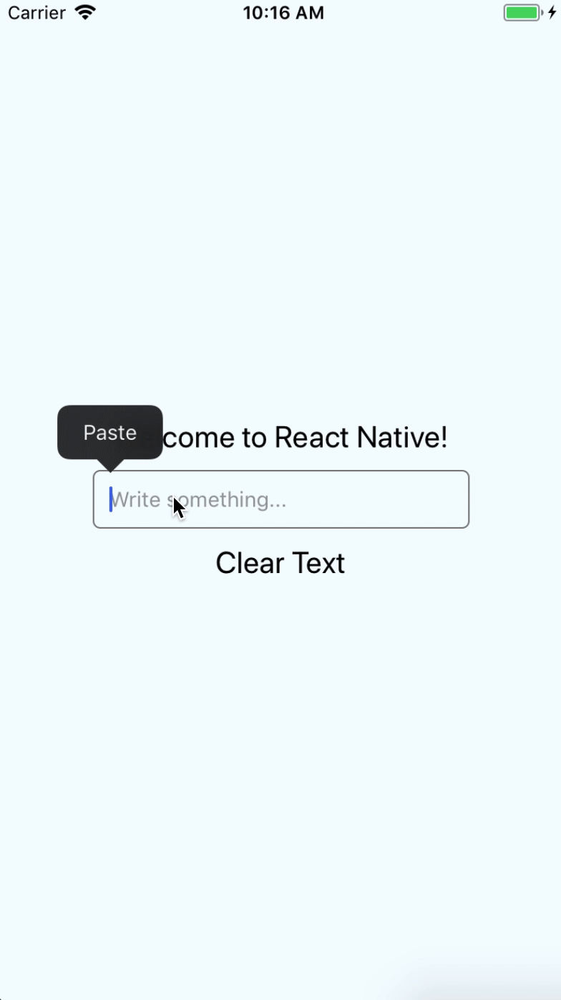

# react-native-text-input-enhance [](https://badge.fury.io/js/react-native-text-input-enhance)

## Demo


## Getting started

`$ npm install react-native-text-input-enhance --save`

## Why you should this TextInput
In React Native version 0.54.0 we have bug
- `clear()` doesn't work from the second time

#Issue
[#18272](https://github.com/facebook/react-native/issues/18272)

This issue can fix in the future with this fix
[#18278](https://github.com/facebook/react-native/pull/18278)

## Usage
```javascript
import RNTextInput from 'react-native-text-input-enhance';

// TODO: What to do with the module?
<TextInput ref={ref => (this.textInputRef = ref)} />

// You can call this fuction in some where to clear text
this.textInputRef.clear();

```

---

## License

This module is [MIT licensed](./LICENSE)

---